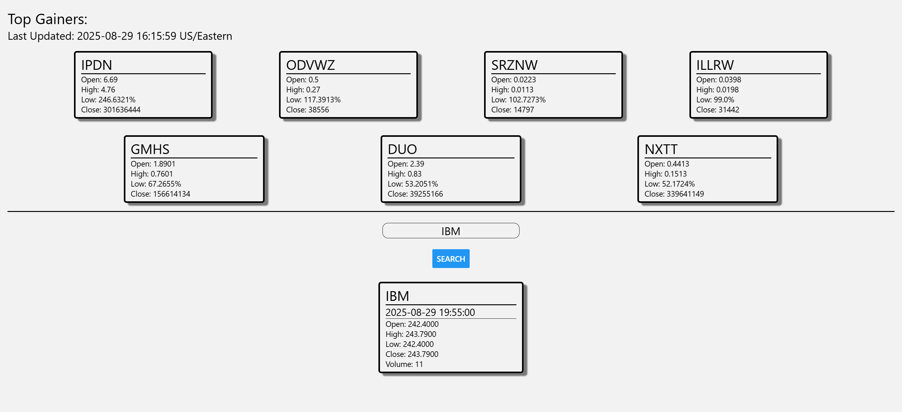
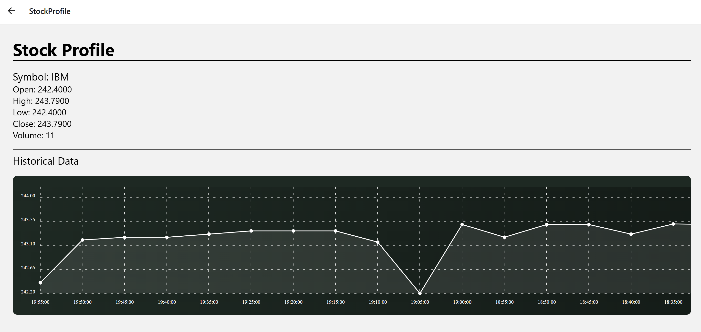

# **📈 StockViewer**
## Project Overview
StockViewer is a web application built with React Native that acts as a simple yet powerful stock information tool. This project served as a practical UI/UX exercise, focusing on robust CSS styling and effective React component management. It features a comprehensive stock lookup and displays historical data powered by a financial API.

## ✨ Key Features
Top Gainers Dashboard: The main screen displays a dynamic list of top-gaining stocks, updated with current market data.

Comprehensive Stock Lookup: Users can search for a specific stock by its ticker symbol to view detailed information.

Real-time Data: Fetches and displays key metrics like Open, High, Low, and Close prices.

Historical Data Visualization: The stock profile page includes an interactive line graph to visualize price trends over time, showcasing the ability to handle and render complex datasets.

## 🛠️ Technologies & Tools
This project was built with a modern and robust technology stack, showcasing proficiency in a variety of key tools:

Frontend: React Native (web), JavaScript (ES6+), HTML5, CSS3

Styling: React Native Styling

State Management: React Hooks (useState, useEffect)

Dependency Management: npm

## Screenshots
Home Page




Stock Profile Page




## 🚀 Getting Started
To get a copy of this project up and running on your local machine, follow these simple steps.

### Prerequisites
```
Node.js (LTS version)
npm
```

### Installation

Navigate to the project directory:
```
  cd ClimateWatcher
```
Install the dependencies:
```
  npm install
```
Start the development server:
```
  npm expo start
```
